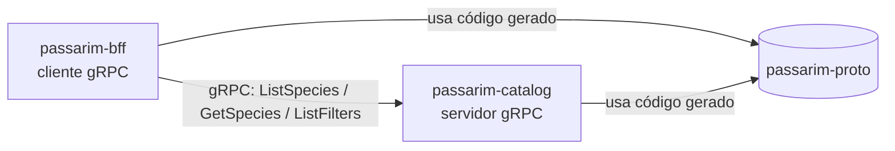

# passarim-proto

Contratos gRPC do **Passarim** — o app das aves do Brasil.
Este repositório é a **fonte da verdade** de como o BFF conversa com a Catalog API.

## Onde ele se encaixa



## Por que um repositório só para contratos?
Se o contrato vivesse dentro do catalog, o BFF dependeria do código do catalog.
Separando, os dois dependem apenas de um acordo comum e versionado.
Ver [ADR-003](https://github.com/velosobr/passarim-docs/blob/main/docs/adr/0003-grpc-interno-rest-externo.md).

## Comandos
| Comando | O que faz |
|---|---|
| `make lint` | Verifica boas práticas nos `.proto` |
| `make generate` | Gera o código Go em `gen/go` |
| `make breaking` | Falha se houver mudança incompatível com a `main` |
| `make test` | Testes de contrato |

## Como usar em outro serviço
```bash
go get github.com/velosobr/passarim-proto@latest
```
```go
import catalogv1 "github.com/velosobr/passarim-proto/gen/go/passarim/catalog/v1"
```
